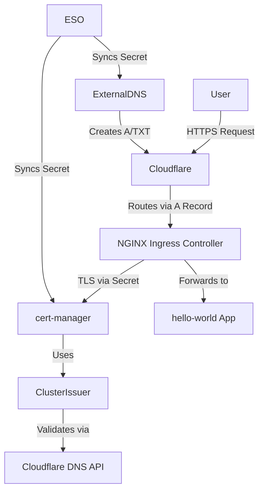

# DNS and HTTPS Reachability Overview for `hello-world` app

This document explains the components involved in securely exposing `hello-world-app-london`

to the public internet over HTTPS **using GitOps and ArgoCD.**

It also includes a quick debug tip using `/etc/hosts`.

## 🌍 DNS & HTTPS Flow Overview

### 1. **ExternalDNS**

* **Purpose:** Automatically manages DNS records in Cloudflare based on Kubernetes resources (Ingresses).
* **How it works:**

  * Watches Ingress resources.
  * For any `host` found (e.g., `app.london.automatalife.com`), it creates or updates corresponding A and TXT records in your Cloudflare DNS zone.
* **Syncs every:** 1 minute.
* **Key Config:**

  * Connected to Cloudflare using a `cloudflare-api-token` secret.

### 2. **Cloudflare API Token Secret**

* **Purpose:** Provides access to Cloudflare's DNS API.
* **Details:**

  * Managed via External Secrets Operator (ESO).
  * Replicated into both `external-dns` and `cert-manager` namespaces.
  * Token must have `Zone.DNS:Edit` permissions.

### 3. **ClusterIssuer**

* **Purpose:** Defines how cert-manager should obtain TLS certificates.
* **Type:** ACME + DNS-01 challenge using Cloudflare.
* **Important fields:**

  * `email`: contact address for Let's Encrypt.
  * `server`: Let's Encrypt ACME URL.
  * `apiTokenSecretRef`: points to the `cloudflare-api-token` secret (in `cert-manager` namespace).

### 4. **cert-manager**

* **Purpose:** Automatically requests and renews TLS certificates from Let's Encrypt.
* **How it works:**

  * Uses the ClusterIssuer to create a wildcard certificate for `*.london.automatalife.com`.
  * Validates DNS-01 challenge using the secret injected by ESO.
  * Stores the final cert in a Kubernetes TLS secret (e.g., `london-wildcard-tls`).

### 5. **NGINX Ingress Controller**

* **Purpose:** Acts as a Layer 7 (HTTP/HTTPS) load balancer.
* **How it works:**

  * Listens on public IP (e.g., `74.220.20.97`) exposed via LoadBalancer service.
  * Routes HTTPS requests to the correct service (`hello`) using the Ingress definition.

### 6. **hello-world App**

* **Purpose:** Simple test app deployed via GitOps.
* **Resources:** One YAML containing:

  * Deployment
  * Service
  * Ingress (uses `london-wildcard-tls` for TLS termination)
* **Route exposed:** `https://app.london.automatalife.com`

---

## 🧪 Quick DNS Debug via /etc/hosts

If global DNS hasn't propagated yet, test locally by adding this entry:

```bash
sudo nano /etc/hosts
```

```text
74.220.20.97   app.london.automatalife.com
```

Then you can test:

```bash
curl -v https://app.london.automatalife.com
```

Or open it in your browser.

> 🧼 Remember to remove the entry later to avoid stale DNS routing.

---

## ✅ Summary of Interactions


